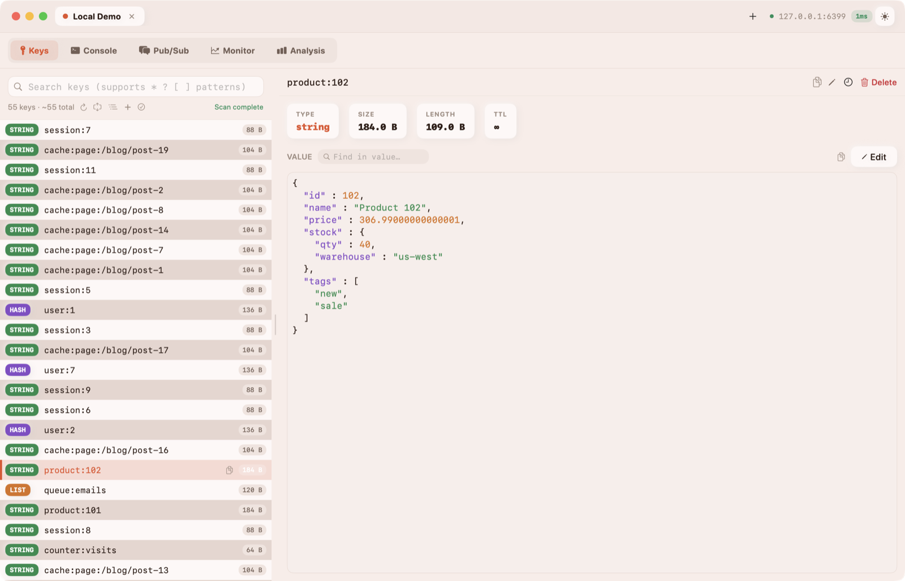
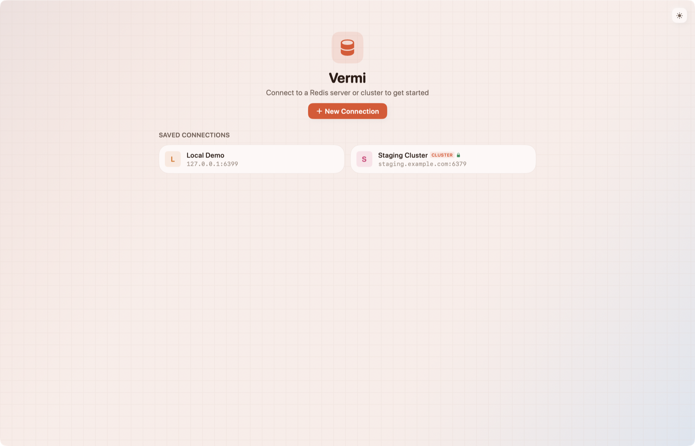
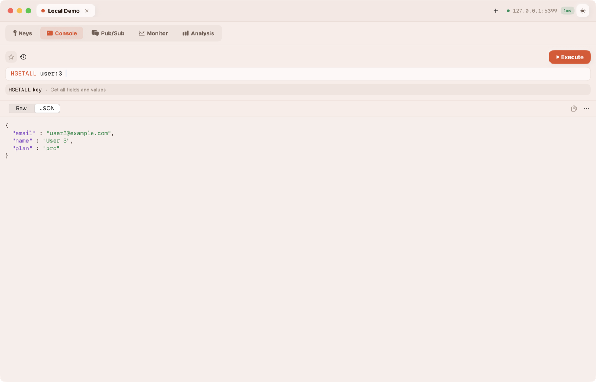
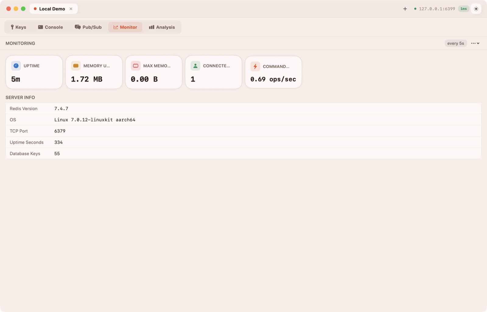
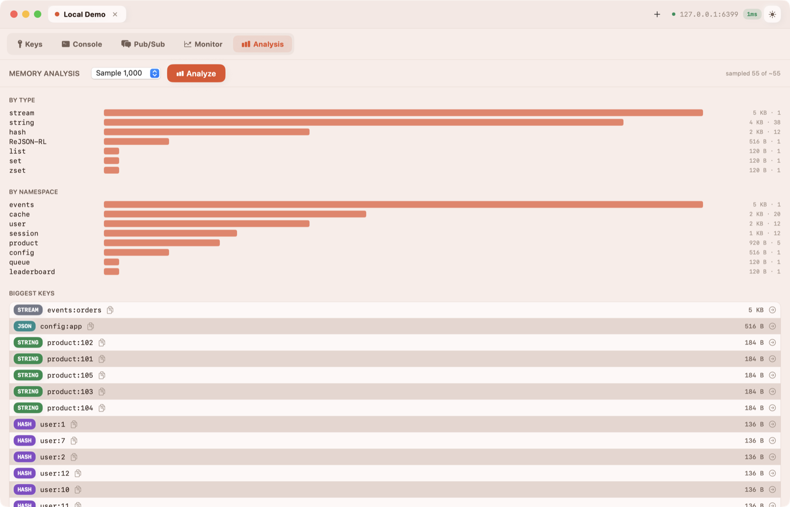
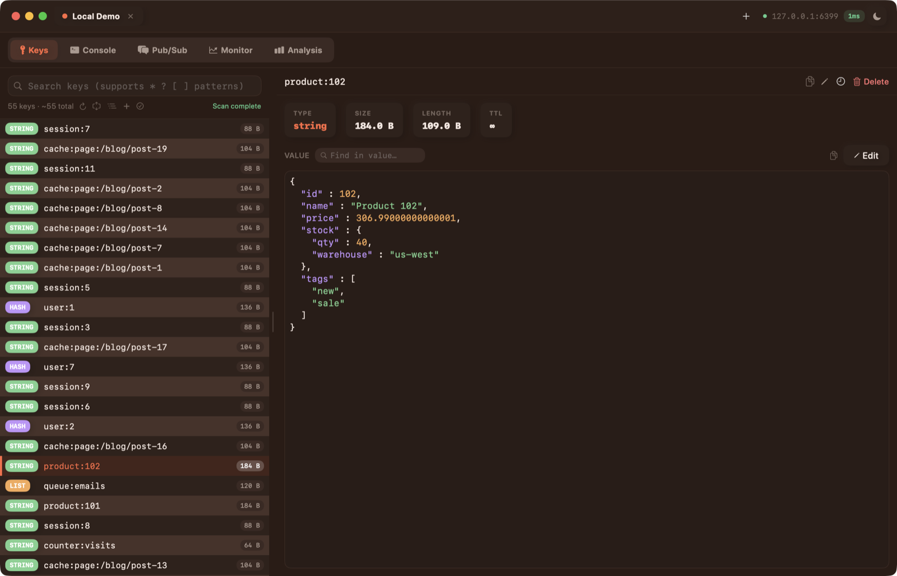

# Vermi

A modern, native Redis client for macOS — SwiftUI, zero external dependencies, built with Swift Package Manager. Supports standalone and cluster connections with a fast, keyboard-friendly UI.



## Screenshots

| Connections | Console |
|---|---|
|  |  |
| **Monitor** | **Memory analysis** |
|  |  |

<details>
<summary>Dark mode</summary>



</details>

## Features

- **Connections** — standalone / cluster connection form, test-before-save, saved connections, passwords stored in the macOS Keychain, optional SSH tunnel (key/agent auth), multiple tabs (the same connection can be opened in several tabs)
- **Key browser** — SCAN-based listing with infinite scroll, flat or tree (namespace) view, smart search (auto-detects glob patterns vs. substrings), saved search patterns, keyboard navigation
- **Value viewer** — syntax-highlighted JSON, typed views for string / list / hash / set / zset / stream / RedisJSON, find-in-value, safe handling of multi-MB values
- **Editing** — edit strings, per-element editing for hash / list / set / zset, add / rename / delete keys, set or remove TTL, bulk delete and bulk TTL
- **Console** — multi-line editor with syntax highlighting, quote-aware parsing, autocomplete for 190+ commands (plus subcommands and key names), per-connection history and favorites, Raw / JSON result view
- **Pub/Sub** — subscribe to channels and see live messages; publish with delivery count
- **Monitor** — live server metrics (uptime, memory, clients, ops/sec), configurable refresh interval, export INFO
- **Analysis** — samples the keyspace to find the biggest keys and memory usage by type and namespace
- **Cluster** — CRC16 slot routing, MOVED/ASK redirect following, per-node connection pool, auto-reconnect
- **UX** — light / dark / system appearance, 7 accent themes, custom titlebar, resizable panels, toast notifications

## Getting started

### 1. Prerequisites

| Requirement | Version | Check |
|---|---|---|
| macOS | 13 Ventura or later | `sw_vers` |
| Swift toolchain | 5.9 or later | `swift --version` |

Install the Swift toolchain with **either**:

- **Xcode 15+** from the App Store (recommended if you want to debug in Xcode), or
- **Command Line Tools** only: `xcode-select --install`

There are no third-party dependencies, so there is nothing else to install.

### 2. Clone

```bash
git clone <repo-url> Vermi
cd Vermi
```

### 3. Build and run

**From the terminal:**

```bash
swift build        # debug build → .build/debug/Vermi
swift run Vermi    # build + launch the app
```

**From Xcode:**

```bash
open Package.swift
```

Select the **Vermi** scheme and **My Mac** as the destination, then press **⌘R**.

### 4. Run the tests

```bash
swift test
```

The live cluster tests are skipped unless you point them at a real server:

```bash
VERMI_LIVE_HOST=127.0.0.1 VERMI_LIVE_PORT=6379 swift test
```

### 5. Get a Redis to connect to

If you don't have a Redis server handy, start one locally:

```bash
# Homebrew
brew install redis && redis-server

# or Docker (redis-stack includes RedisJSON)
docker run -d --name redis -p 6379:6379 redis/redis-stack-server:latest
```

In Vermi, click **New Connection**, enter host `127.0.0.1`, port `6379`, then **Test Connection** and **Save**. Double-click the saved connection to open it.

### 6. Package the app (`.app` + `.dmg`)

```bash
./scripts/build-dmg.sh
```

This builds a **release** binary, then produces:

- `dist/Vermi.app` — drag to `/Applications`
- `Vermi.dmg` — disk image for sharing

The app is ad-hoc signed only (not notarized). On another Mac, Gatekeeper will block the first launch. Right-click the app → **Open**, or clear the quarantine flag:

```bash
xattr -dr com.apple.quarantine /Applications/Vermi.app
```

## Keyboard shortcuts

| Shortcut | Action |
|---|---|
| ⌘N / ⌘T | New connection / new tab |
| ⌘W | Close tab |
| ⌘1 … ⌘5 | Keys / Console / Pub/Sub / Monitor / Analysis |
| ⌘F | Search keys |
| ⌘R | Refresh keys |
| ↑ / ↓ | Move through the key list |
| Enter | Run command (Console) |
| Shift+Enter | New line (Console) |
| Tab | Accept autocomplete suggestion |

## Troubleshooting

- **Packaged app doesn't show my changes** — `swift build` only updates `.build/debug`. The DMG is built from `.build/release`, so always package with `./scripts/build-dmg.sh` (it runs `swift build -c release` for you).
- **"Vermi can't be opened because Apple cannot check it for malicious software"** — see the Gatekeeper note in step 6.
- **Build fails with an API availability error** — the project targets macOS 13; don't use newer SwiftUI/AppKit APIs.
- **Cluster: "Cannot reach node …"** — the cluster advertises node addresses (often VPC-internal IPs) that aren't reachable from your Mac. Connect from inside the network or through a bastion/VPN.
- **Purple "Publishing changes from background threads" warnings in Xcode** — these can linger from a previous run. Clean Build Folder (⇧⌘K) and run again before investigating.

## Project layout

```
RedisClient/           app sources (SPM target "RedisClient", product "Vermi")
├── App/               entry point, AppDelegate
├── Models/            RedisConnection, key/info models
├── Network/           NetworkChannel (actor, TCP/TLS), RESP parser/encoder, cluster helpers
├── Services/          RedisClient (actor: command API, routing, pipelining), SSH tunnel, Keychain
├── ViewModels/        AppState + per-tab view models (all @MainActor)
├── Views/             feature views + Common/ components
├── Utilities/         Theme (design system), command catalog
└── Resources/         app icon
RedisClientTests/      unit tests
scripts/build-dmg.sh   release build + .app/.dmg packaging
docs/screenshots/      README images
```

## Architecture

MVVM over an actor-based network layer, no third-party dependencies.

- **Network** — `NetworkChannel` (actor, TCP/TLS via Network.framework, serialized command queue, pipelining), RESP3 `RESPParser`/`RESPEncoder`/`RESPValue`, `RedisCluster` (slot math + redirects)
- **Services** — `RedisClient` (actor; command API, per-node channel pool, MOVED/ASK routing, auto-reconnect)
- **ViewModels** — `AppState` (root store, per-tab view models), plus KeyBrowser / CommandExecutor / PubSub / Monitoring / Analysis view models (all `@MainActor`)
- **Views** — `MainWindowView` + custom titlebar, per-feature views, shared components in `Views/Common/`
- **Design system** — `Theme.swift` (soft-UI, dynamic light/dark colors, accent themes, button styles, components)

See **[AGENTS.md](AGENTS.md)** for the full development guide: conventions, key flows, concurrency rules, and known pitfalls.

## Not yet implemented

- Sentinel discovery (the connection type exists in the form but isn't resolved yet)
- Read routing to cluster replicas (`READONLY`)
